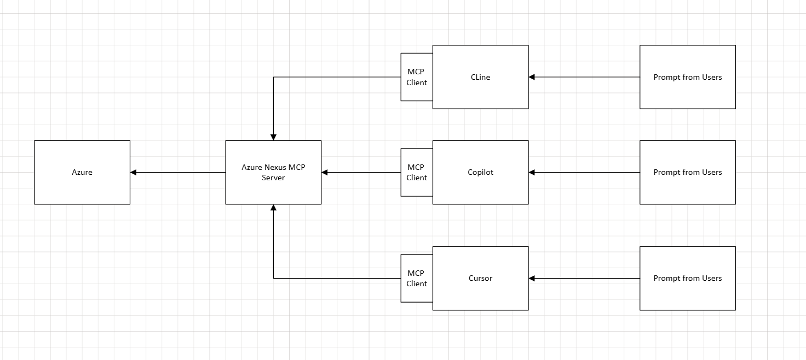
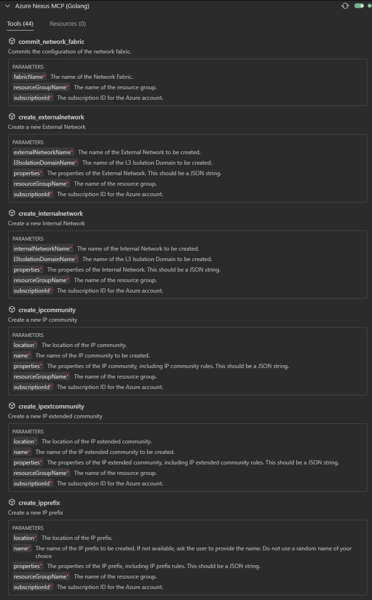
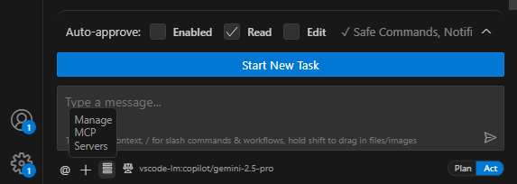
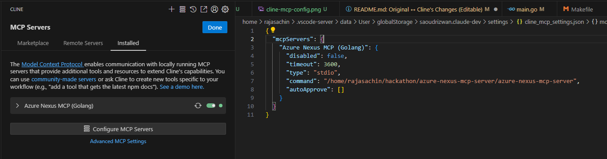

# MCP server for Azure Nexus using the Go SDK

This is an implementation of a MCP server for Azure Nexus built using its [Go SDK](github.com/Azure/azure-sdk-for-go/sdk/resourcemanager/managednetworkfabric/armmanagednetworkfabric). It exposes the following tools for interacting with Azure Nexus Resources:


## Functionalities
- **Resource Group**: Create, delete, get, and list resources in a resource group.
- **IP Prefix**: Create, delete, patch, and get IP prefixes.
- **IP Community**: Create, delete, patch, and get IP communities.
- **IP Extended Community**: Create, delete, patch, and get IP extended communities.
- **Route Policy**: Create, delete, patch, and get route policies.
- **L2 Isolation Domain**: Create, delete, patch, get, enable, disable, and get administrative/configuration state of L2 isolation domains.
- **L3 Isolation Domain**: Create, delete, patch, get, enable, disable, and get administrative/configuration state of L3 isolation domains.
- **Internal Network**: Create, patch, and get internal networks.
- **External Network**: Create, patch, and get external networks.
- **Network Fabric**: Commit and get network fabrics.


> The project uses [mcp-go](https://github.com/mark3labs/mcp-go) as the MCP implementation.

## How to run

> Word(s) of caution: As much as I want folks to benefit from this, I have to call out that Large Language Models (LLMs) are non-deterministic by nature and can make mistakes. I would recommend you to **always validate** the results before making any decisions based on them.

```bash
git clone https://github.com/sachinDcoder/mcp_azure_nexus_go.git
cd mcp_azure_nexus_go
```

You can use the provided `Makefile` to build and run the server.
- `make build`: Builds the server binary.
- `make run`: Builds and runs the server.
- `make tidy`: Tidies the Go module dependencies.
- `make clean`: Cleans the build artifacts.

Alternatively, you can manually build and run the server:
```bash
go build -o azure-nexus-mcp-server .
```

```bash
rajasachin@CPC-rajas-TQPGA:~/hackathon/azure-nexus-mcp-server$ go build -o azure-nexus-mcp-server .
rajasachin@CPC-rajas-TQPGA:~/hackathon/azure-nexus-mcp-server$ ./azure-nexus-mcp-server
Welcome to Azure Nexus MCP server!
Registering tools...

```

### Configure the MCP server

This will differ based on the MCP client/tool you use. For VS Code you can [follow these instructions](https://code.visualstudio.com/docs/copilot/chat/mcp-servers#_add-an-mcp-server) on how to configure this server using a `mcp.json` file.

Here is an example of the [mcp.json file](mcp.json):

```json
{
  "servers": {
    "Azure Nexus MCP (Golang)": {
      "type": "stdio",
      "command": "/home/rajasachin/hackathon/azure-nexus-mcp-server/azure-nexus-mcp-server",
    }
  }
}
```

Here is an example of Claude Desktop configuration:

```json
{
  "mcpServers": {
    "Azure Nexus MCP (Golang)": {
      "command": "enter path to binary e.g. /home/rajasachin/hackathon/azure-nexus-mcp-server/azure-nexus-mcp-server",
      "args": []
    }
    //other MCP servers...
  }
}
```

For Cline, add the following configuration to your settings file. You can find the settings file by opening the command palette and searching for "Cline: Open Settings (JSON)".


```json
{
  "mcpServers": {
    "Azure Nexus MCP (Golang)": {
      "type": "stdio",
      "command": "/home/rajasachin/hackathon/azure-nexus-mcp-server/azure-nexus-mcp-server",
      "timeout": 1800
    }
  }
}
```
